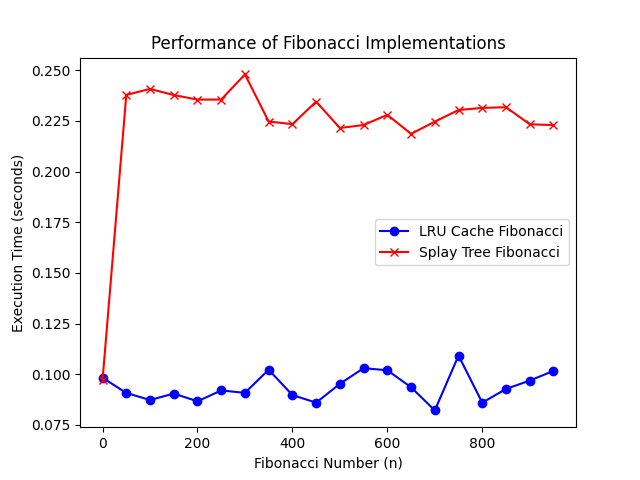

# Results

## No caching vs Cache

`Time without cache: 10.17 s` ***VS*** `Time with cache: 16.09 s`

The main reason that `Time with cache` is higher than `Time without cache` in our case is that since the **cache size is relatively small** and **the queries are random** and **have non-overlapping ranges**, the cache does not provide enough efficiency gains to compensate for the overhead, making it slower than performing operations without caching.

- Each time you perform an operation, the system must check if the result is already in the cache, and then either fetch it from the cache or calculate and store the result.

    - A lot of unique queries with non-overlapping ranges lead to repeated cache misses, which makes the benefit of caching less noticeable.

- The logic of the LRU cache involves moving items in a linked list and maintaining the state of the cache. Operations such as moving items to the foreground or removing the least used items increase the time complexity.
    
    - If you perform a large number of operations, the cache pushes out items, which leads to inefficient use of the cache and an increase in the rate of displacement.

## LRU Cache vs Splay Tree

The graph shows that the execution time for `LRU Cache` is much shorter than for `Splay Tree`.

`LRU Cache` provides O(1) access to stored values. @lru_cache efficiently caches already calculated values, which avoids unnecessary recursive calls.

`Splay Tree` is more expensive because each request requires reorganizing the tree, which adds overhead. This is due to additional insertion and search operations in Splay Tree, which in the worst case have a complexity of O(log n).

|       n       |      `LRU Cache Time (s)`      |     `Splay Tree Time (s)`      |
|:-------------:|:----------------------------:|:----------------------------:|
|       0       |          0.0982683           |          0.0971793           |
|      50       |          0.0907925           |          0.2378156           |
|      100      |          0.0873015           |          0.2407685           |
|      150      |          0.0904827           |          0.2377424           |
|      200      |          0.0866632           |          0.2355124           |
|      250      |          0.0920159           |          0.2355257           |
|      300      |           0.090844           |          0.2479383           |
|      350      |          0.1022358           |          0.2246982           |
|      400      |          0.0897486           |          0.2233742           |
|      450      |          0.0859884           |          0.2345101           |
|      500      |          0.0952882           |           0.221478           |
|      550      |           0.103008           |          0.2229751           |
|      600      |          0.1019686           |          0.2279981           |
|      650      |          0.0935851           |           0.218599           |
|      700      |          0.0821738           |          0.2246299           |
|      750      |          0.1092008           |          0.2303657           |
|      800      |          0.0859767           |           0.231405           |
|      850      |          0.0927691           |          0.2317553           |
|      900      |          0.0968742           |          0.2233342           |
|      950      |           0.101663           |          0.2229229           |